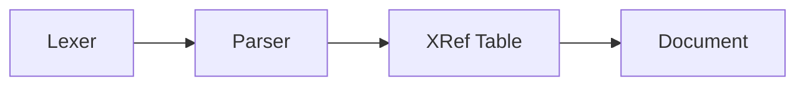
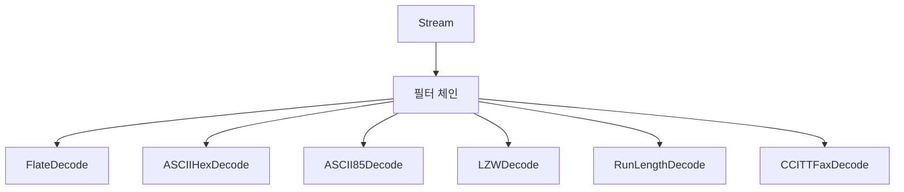
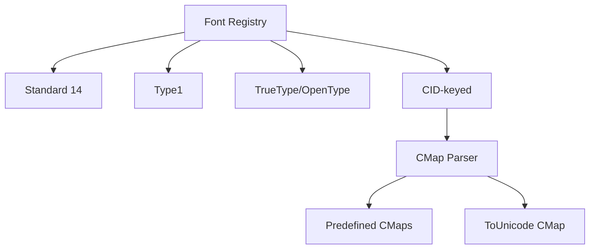
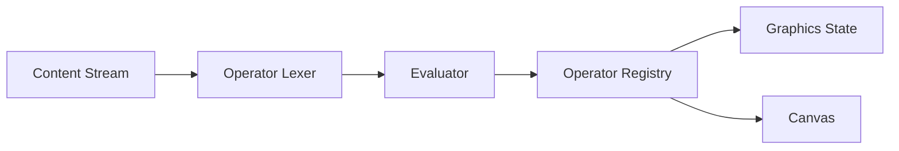
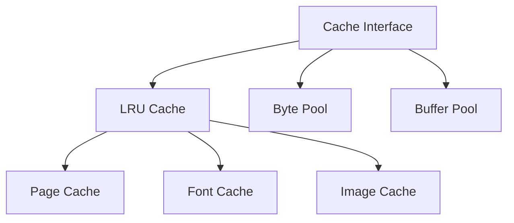
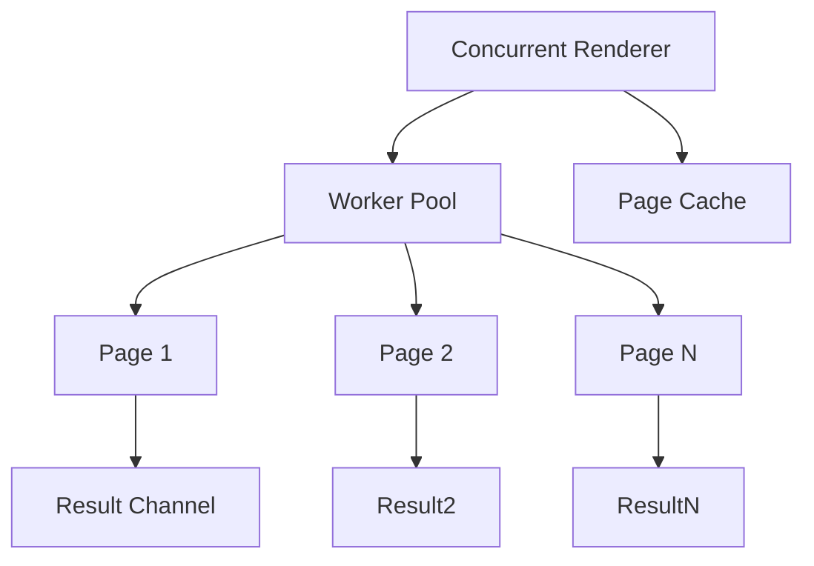
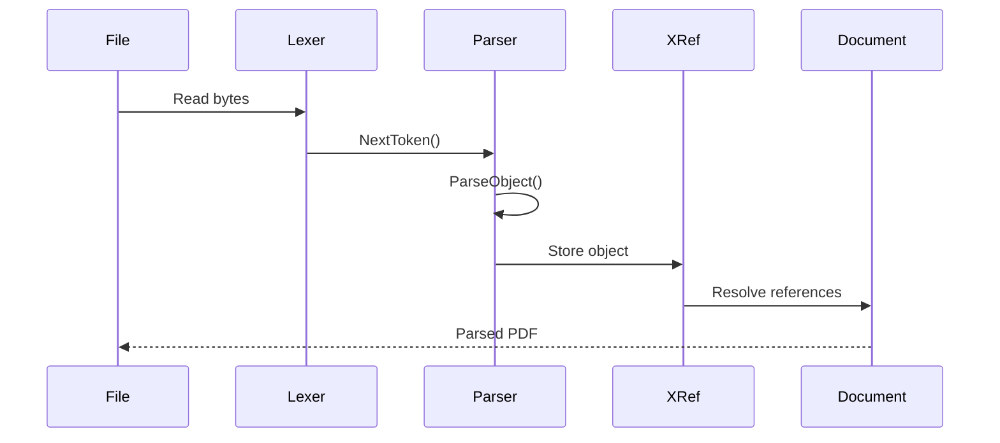
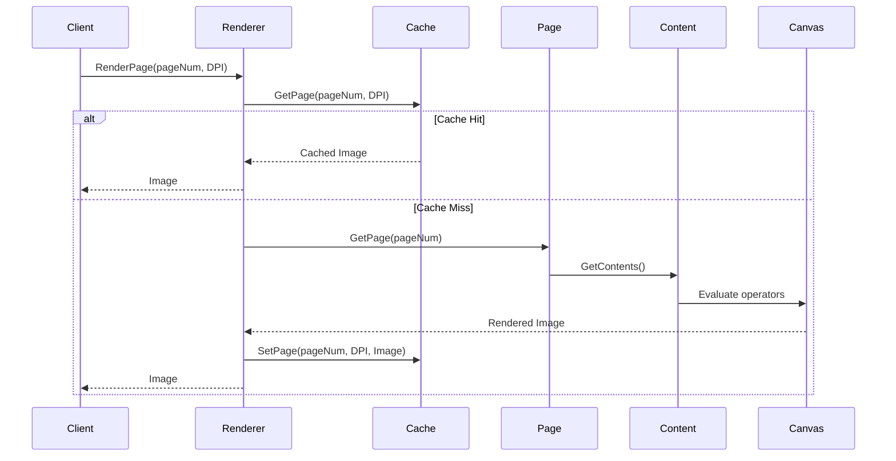
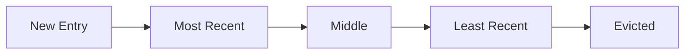
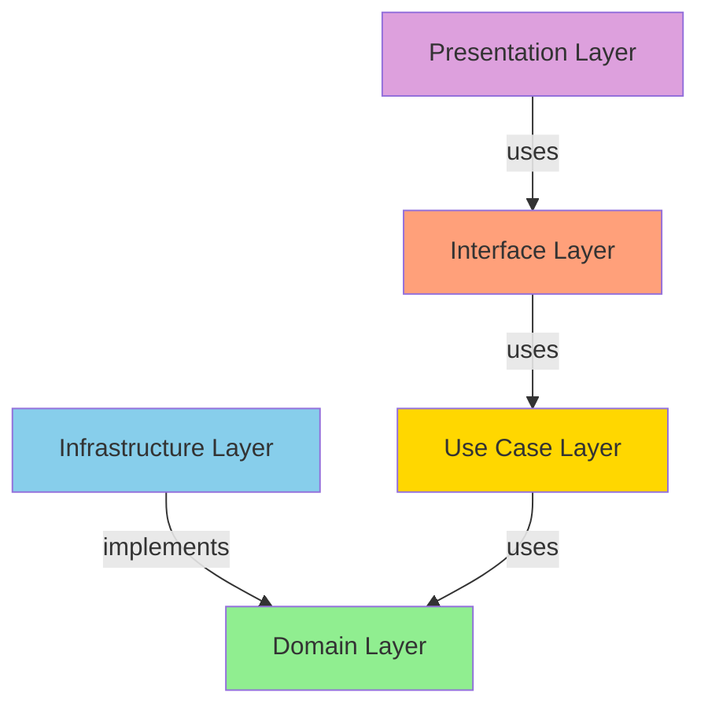

# Go PDF Rendering Library - 아키텍처

## 개요

이 라이브러리는 Clean Architecture를 따르며 PDF.js를 순수 Go로 포팅한 것입니다. 브라우저 의존성 없이 PDF 문서를 파싱하고 이미지로 렌더링하며, 텍스트 추출 및 어노테이션 처리 기능을 제공합니다.

## 최신 업데이트 (v0.9.0-poppler24-02-0-202605.1)

### 최근 구현된 기능
- **XRef 스트림 파싱**: 압축된 XRef 스트림 지원, /Prev 체인을 통한 증분 업데이트
- **CFF/Type1C 폰트**: Compact Font Format 파싱 및 글리프 렌더링
- **바이너리 CMap**: 바이너리 형식 CMap 파서
- **폰트 서브셋팅**: 폰트 최적화를 위한 서브셋터 구조
- **스트림 벤치마크**: 모든 압축 필터에 대한 포괄적인 성능 측정
- **통합 테스트**: 다양한 PDF 버전 및 기능 테스트

## 계층 구조

## 계층 구조

```mermaid
graph TB
    subgraph "Presentation Layer"
        CMD[cmd/]
        CLI[CLI Tools]
    end

    subgraph "Interface Layer"
        Presenter[internal/interface/presenter]
        Controller[internal/interface/controller]
    end

    subgraph "Use Case Layer"
        Parser[internal/usecase/parser]
        Renderer[internal/usecase/renderer]
        Extractor[internal/usecase/extractor]
    end

    subgraph "Domain Layer"
        Entity[internal/domain/entity]
        Repository[internal/domain/repository]
        Canvas[internal/domain/canvas]
        Font[internal/domain/font]
        Content[internal/domain/content]
        Annotation[internal/domain/annotation]
        Renderer2[internal/domain/renderer]
        Cache[internal/domain/cache]
    end

    subgraph "Infrastructure Layer"
        PDF[internal/infrastructure/pdf]
        FontImpl[internal/infrastructure/font]
        Image[internal/infrastructure/image]
        CanvasImpl[internal/infrastructure/canvas]
        ContentImpl[internal/infrastructure/content]
        AnnotationImpl[internal/infrastructure/annotation]
        RendererImpl[internal/infrastructure/renderer]
        CacheImpl[internal/infrastructure/cache]
    end

    CMD --> Controller
    Controller --> Presenter
    Presenter --> Use Case
    Parser --> Entity
    Renderer --> Canvas
    Extractor --> Content

    Entity --> Repository
    Canvas --> CanvasImpl
    Font --> FontImpl
    Content --> ContentImpl
    Annotation --> AnnotationImpl
    Renderer2 --> RendererImpl
    Cache --> CacheImpl

    Repository --> PDF
    Repository --> FontImpl
    Repository --> Image
```

## 핵심 컴포넌트

### 1. 도메인 계층 (Domain Layer)

비즈니스 로직과 엔티티를 정의하는 가장 내부의 계층입니다.

#### 엔티티 (Entity)
- **Document**: PDF 문서를 나타내는 최상위 엔티티
- **Page**: PDF 페이지 엔티티
- **Font**: 폰트 인터페이스
- **Annotation**: 어노테이션 엔티티

#### 값 객체 (Value Objects)
- **Dict**: PDF 사전 (캡슐화된 맵)
- **Array**: PDF 배열
- **Name**: PDF 이름 (불변)
- **Ref**: 간접 객체 참조
- **Stream**: PDF 스트림

#### 리포지토리 인터페이스
- **XRef**: 교차 참조 테이블 인터페이스
- **Stream**: 스트림 처리 인터페이스

#### 전용 인터페이스
- **Canvas**: 렌더링 캔버스 인터페이스
- **Renderer**: 페이지 렌더러 인터페이스
- **Cache**: 캐싱 인터페이스

### 2. 인프라스트럭처 계층 (Infrastructure Layer)

외부 시스템과의 통합을 담당합니다.

#### PDF 파싱


#### 스트림 처리


#### 폰트 처리


#### 콘텐츠 평가


#### 캐싱


#### 병렬 렌더링


## 데이터 흐름

### PDF 파싱 흐름



### 페이지 렌더링 흐름



## 동시성 모델

### 병렬 페이지 렌더링

```go
// 워커 풀 패턴 사용
workerSemaphore := make(chan struct{}, maxWorkers)

for _, pageNum := range pageNumbers {
    go func(pn int) {
        // 워커 슬롯 획득
        workerSemaphore <- struct{}{}
        defer func() { <-workerSemaphore }()

        // 컨텍스트 취소 확인
        select {
        case <-ctx.Done():
            resultChan <- RenderResult{Error: ctx.Err()}
            return
        default:
        }

        // 페이지 렌더링
        img, err := r.RenderPage(ctx, page, options)
        resultChan <- RenderResult{Image: img, Error: err}
    }(pageNum)
}
```

### 스레드 안전한 캐시

```go
// RWMutex로 보호된 LRU 캐시
type lruCache struct {
    mu         sync.RWMutex
    maxSize    int
    maxBytes   int64
    entries    map[CacheKey]*lruEntry
    head, tail *lruEntry
}

// 읽기 작업은 동시 실행 가능
func (c *lruCache) Get(key CacheKey) (interface{}, bool) {
    c.mu.RLock()
    defer c.mu.RUnlock()
    // ...
}

// 쓰기 작업은 독점 실행
func (c *lruCache) Set(key CacheKey, value interface{}) error {
    c.mu.Lock()
    defer c.mu.Unlock()
    // ...
}
```

## 캐싱 전략

### LRU (Least Recently Used) 캐시

- **이중 연결 리스트**: O(1) 삽입/삭제
- **해시 맵**: O(1) 조회
- **TTL**: 시간 기반 만료
- **바이트 제한**: 메모리 사용량 제어



### 페이지 캐시

```go
// 페이지 번호 + DPI 조합으로 캐싱
type pageCacheKey struct {
    pageNum int
    dpi     float64
}

// 같은 페이지라도 DPI가 다르면 별도 캐시
page at 72 DPI → cached_key_1
page at 150 DPI → cached_key_2
```

## 오류 처리

### 오류 유형

```go
type ErrorType int

const (
    ErrTypeInvalid   ErrorType = iota  // 잘못된 데이터
    ErrTypeNotFound                    // 리소스 없음
    ErrTypeEncryption                 // 암호화 관련
    ErrTypeFont                       // 폰트 관련
    ErrTypeRendering                  // 렌더링 관련
)
```

### 오류 래핑

```go
// 컨텍스트와 원인 보존
return &PDFError{
    Op:   "parse_xref",
    Err:  err,
    Type: ErrTypeInvalid,
}
```

## 성능 최적화

### 1. 객체 풀링 (Object Pooling)

```go
// sync.Pool으로 바이트 버퍼 재사용
type bytePool struct {
    pool sync.Pool
}

func (p *bytePool) GetBytes(size int) []byte {
    buf := p.pool.Get()
    if b, ok := buf.([]byte); ok && cap(b) >= size {
        return b[:size]
    }
    return make([]byte, size)
}
```

### 2. 캐싱 (Caching)

- 페이지 렌더링 결과 캐싱
- 파싱된 폰트 캐싱
- 디코딩된 이미지 캐싱

### 3. 병렬 처리 (Parallelism)

- 다중 페이지 동시 렌더링
- 워커 풀 패턴
- 컨텍스트 기반 취소

## 테스트 전략

### 단위 테스트

```
test/unit/
├── annotation/    # 어노테이션 테스트
├── cache/         # 캐시 테스트
├── canvas/        # 캔버스 테스트
├── content/       # 콘텐츠 평가 테스트
├── entity/        # 엔티티 테스트
├── font/          # 폰트 테스트
├── image/         # 이미지 테스트
├── parser/        # 파서 테스트
├── renderer/      # 렌더러 테스트
├── stream/        # 스트림 테스트
├── text/          # 텍스트 추출 테스트
├── truetype/      # TrueType 테스트
└── xref/          # XRef 테스트
```

### 테스트 커버리지 목표

- 전체: > 80%
- 도메인 계층: > 90%
- 인프라스트럭처 계층: > 75%

## 의존성 규칙



**중요**: 의존성은 항상 외부에서 내부로 향합니다. 내부 계층은 외부 계층을 알지 못합니다.
