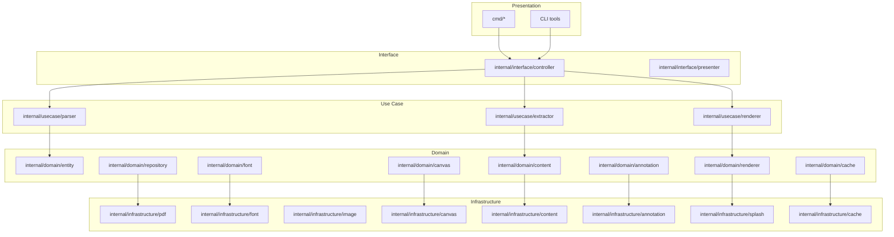
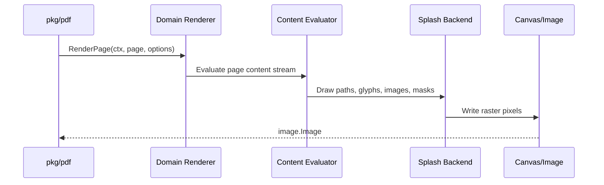
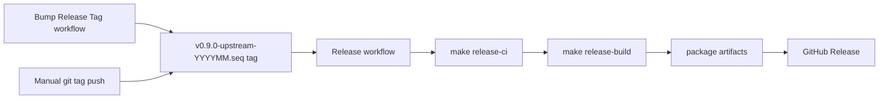

# Architecture

Korean localization: [architecture.ko.md](architecture.ko.md).

## Overview

The project follows Clean Architecture. The domain layer owns the PDF concepts and rendering contracts, while infrastructure packages provide concrete parsers, decoders, renderers, and external integrations.

Dependency direction:

```text
Infrastructure -> Interface -> Use Case -> Domain
```

The domain layer must not depend on infrastructure packages.

## Layer Diagram



## Package Responsibilities

- `cmd/`: CLI entry points and diagnostic tools.
- `pkg/pdf`: public API facade for document opening, page access, rendering, text extraction, and annotations.
- `internal/domain`: core model, contracts, rendering decisions, cache abstractions, and PDF concepts.
- `internal/usecase`: application workflows that coordinate parsing, rendering, and extraction.
- `internal/interface`: adapters between CLI/API inputs and use case boundaries.
- `internal/infrastructure`: concrete PDF parsing, font, image, canvas, splash, and cache implementations.
- `test/`: integration and end-to-end tests plus fixture data.

## Rendering Path



## Design Rules

- Keep struct fields private by default.
- Use constructor functions for invariants and required dependencies.
- Place small interfaces near the package that consumes them.
- Keep public APIs in `pkg/pdf` stable and documented.
- Gate optional native dependencies behind build tags.
- Preserve Poppler parity tests and comparison artifacts for rendering changes.

## Release Architecture

The release path is tag-driven:


