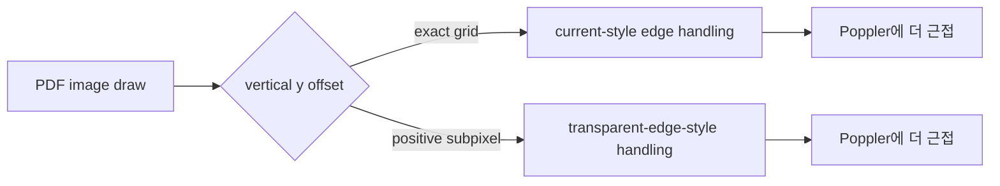

# RGB Subpixel Vertical Offset Contract

## 개요

이 문서는 pure RGB synthetic lane에서 관찰된 `zero vs positive subpixel vertical offset` 차이를 계약으로 정리하고,
현재 renderer와 Poppler/PDF.js 계열 rasterization rule이 어디서 갈라지는지 설명한다.

이 문서의 결론은 sample corpus 전체에 일반화된 사실이 아니라,
현재 synthetic probe와 sample-free pure RGB lane에서 재현된 결과를 기반으로 한 설계 문서다.

## 문제 정의

지금까지의 probe에서 다음 사실이 반복 확인됐다.

- pure RGB small-page lane에서는 `transparent edge + white backdrop` reference가 current보다 Poppler에 더 가깝다.
- sample-like large-page geometry에서는 대부분 current가 더 낫다.
- 하지만 large-page에서도 `y-centered` 근방의 매우 좁은 positive subpixel band에서는 다시 `transparent edge` 계열이 더 낫다.
- binary-search를 반복한 결과, 현재 synthetic probe 기준으로 전환점은 대략 다음처럼 좁혀졌다.

```text
410.000000000000 < threshold <= 410.0000009536743
```

즉 practical하게는 `y offset == 0`일 때와 `y offset > 0`일 때가 서로 다른 rasterization contract처럼 보인다.

## 관찰된 계약

### 핵심 계약

- `exact integer-aligned y`:
  - current renderer가 더 Poppler에 가깝다.
- `positive subpixel y`:
  - `transparent edge + white backdrop` reference가 더 Poppler에 가깝다.

이 계약은 [synthetic_render_parity_test.go](/workspace/pdf-reader/go-pdf/test/integration/pdf/synthetic_render_parity_test.go)의
`TestSyntheticRGBTransparentEdgeZeroVsPositiveSubpixelYOffsetContract`로 고정한다.

### 현재 explicit mode의 실제 surface

현재 구현된 `experimental-rgb-transparent-edge-upscale-v1`는 reference 가설보다 더 좁은 surface에서만 실제로 차이를 만든다.

| Signature | Geometry | Legacy vs Experimental |
| --- | --- | --- |
| `small_page_positive_subpixel_y` | `24x24 page`, `16x16 src`, `20x20 dst`, `(1.5, 1.5)` | experimental better |
| `large_page_zero_y_offset` | `595x842 page`, `16x16 src`, `20x20 dst`, `(100, 410.0)` | exact match |
| `large_page_positive_y_non_centered` | `595x842 page`, `16x16 src`, `20x20 dst`, `(100, 100)` | exact match |
| `large_page_positive_y_centered_band` | `595x842 page`, `16x16 src`, `20x20 dst`, `(100, 411)` | exact match |

이 결과는 [synthetic_render_parity_test.go](/workspace/pdf-reader/go-pdf/test/integration/pdf/synthetic_render_parity_test.go)의
`TestSyntheticRGBTransparentEdgeExperimentalModeSignatureMatrixProbeAgainstPoppler`로 고정한다.

tiny lane 내부에서도 content class에 따라 effect surface가 갈린다.

| Pattern family | Geometry | Legacy vs Experimental |
| --- | --- | --- |
| `flat` | `24x24 page`, `16x16 src`, `20x20 dst`, `(1.5, 1.5)` | legacy better |
| `gradient` | `24x24 page`, `16x16 src`, `20x20 dst`, `(1.5, 1.5)` | experimental better |
| `checker` | `24x24 page`, `16x16 src`, `20x20 dst`, `(1.5, 1.5)` | experimental better |
| `tiled_identity` | `24x24 page`, `16x16 src`, `20x20 dst`, `(1.5, 1.5)` | experimental better |

이 결과는 [synthetic_render_parity_test.go](/workspace/pdf-reader/go-pdf/test/integration/pdf/synthetic_render_parity_test.go)의
`TestSyntheticRGBTransparentEdgeExperimentalModePatternFamilyProbeAgainstPoppler`로 고정한다.

### 의미

현재 차이는 broad geometry, footprint, DPI, coarse phase 문제가 아니라,
`vertical source-edge treatment`가 `y == exact grid`와 `y > 0 subpixel`에서 달라지는 문제로 해석하는 편이 더 타당하다.

다만 이 계약이 곧바로 현재 explicit mode의 broad effect surface를 뜻하지는 않는다.
현재 구현에서는 large-page tiny-footprint signature 대부분이 `legacy`와 pixel-identical이라,
실제 draw-path effect는 `small-page positive-subpixel-y tiny synthetic lane`에 사실상 한정된다.

## 현재 renderer와 reference의 차이

### 현재 renderer

현재 synthetic current path는 바깥쪽 source sample을 사실상 clamp된 opaque edge처럼 다루는 쪽에 가깝다.
이 경로는 integer-aligned placement에서는 Poppler에 더 가깝지만,
positive subpixel vertical offset에서는 Poppler보다 edge contribution이 더 강하게 남는다.

### transparent-edge reference

`transparent edge + white backdrop` reference는 source rect 밖을 투명으로 간주한 뒤
white page 위에 합성하는 browser-canvas-like semantics를 흉내 낸다.

이 경로는 integer-aligned placement에서는 과도하지만,
positive subpixel vertical offset에서는 Poppler에 더 가까워진다.

### PDF.js / Poppler와의 관계

다음은 source-edge handling 관점에서의 해석이다.



이건 구현 내부를 직접 디스어셈블한 결론이 아니라,
synthetic parity probe에서 도출한 행동 기반 inference다.

## 왜 PDF.js/Poppler와 다르게 보이는가

현재 synthetic 결과만 보면, 같은 RGB image라도 다음 세 요소가 동시에 결과를 바꾼다.

1. source rect 바깥 샘플을 clamp할지 transparent로 볼지
2. 그 샘플을 어떤 backdrop에 합성할지
3. placement가 exact grid인지 positive subpixel인지

우리가 좁힌 신호는 세 번째 축이 첫 번째 축을 선택하는 branch condition처럼 보인다는 점이다.

즉 문제는 단순 bilinear kernel 선택이 아니라,
`source edge semantics`를 언제 바꿀 것인가에 대한 contract 문제다.

## 구현 후보

### 후보 A: explicit experimental mode 유지

설명:
- 기존 `legacy`는 그대로 둔다.
- `experimental-rgb-transparent-edge-upscale-v1` 같은 별도 mode를 두고,
  `positive subpixel y` synthetic lane에서만 실험한다.

장점:
- 회귀 범위를 가장 잘 통제할 수 있다.
- sample corpus에 부작용을 만들지 않는다.

단점:
- 실제 sample 문서로 아직 전이되지 않은 상태라 user-facing 효과가 거의 없다.

적합도:
- 가장 안전한 다음 단계.

### 후보 B: renderer 내부의 source-edge contract를 조건부 분기

설명:
- axis-aligned RGB draw에서 `y offset == 0`이면 기존 경로,
  `y offset > 0`이면 transparent-edge treatment를 쓰는 좁은 branch를 만든다.

장점:
- synthetic contract를 구현에 가장 직접적으로 반영한다.

단점:
- sample `003/008`에서는 same semantics가 전이되지 않았기 때문에,
  실제 corpus에선 regression 가능성이 높다.
- `x/y` 비대칭 branch가 생겨 코드 복잡도가 올라간다.

적합도:
- 바로 기본값에 넣기엔 위험하다.

### 후보 C: sampler가 아니라 image reconstruction contract 객체 도입

설명:
- `ImageSamplingMode`와 별개로 `ImageEdgeMode` 또는 `ImageReconstructionContract`를 도입한다.
- 예시:
  - `opaque_clamp`
  - `transparent_edge_over_white`
  - 향후 `transparent_edge_over_page`

장점:
- 지금처럼 kernel, phase, colorspace, edge semantics가 섞여 있는 문제를 구조적으로 분리할 수 있다.
- synthetic/probe를 production 구조에 더 자연스럽게 연결할 수 있다.

단점:
- 설계 비용이 가장 크다.
- 단기 회귀 수정에는 과할 수 있다.

적합도:
- 중기적으로 가장 바람직한 구조 개선.

## 권장안

현재 시점의 권장안은 다음 순서다.

1. 후보 A로 synthetic contract만 explicit experimental path에 연결한다.
2. sample-free RGB lane과 actual object synthetic(`003/008` 유사)에서 side effect를 더 본다.
3. 전이 가능성이 생기면 후보 C 방향으로 구조화한다.

후보 B를 바로 기본값에 넣는 것은 아직 근거가 부족하다.

## 다음 구현 단위

작은 단위로는 아래 순서가 적절하다.

1. `zero_y_offset` vs `positive_subpixel_y_offset` contract test 유지
2. renderer 내부에서 `ImageEdgeMode`를 아직 public surface 없이 domain type으로만 도입
3. synthetic-only experimental path에서 `transparent_edge_over_white` edge treatment를 연결
4. sample object synthetic(`003`, `008`)와 pure RGB lane을 같이 재검증

## 참조 테스트

- [synthetic_render_parity_test.go](/workspace/pdf-reader/go-pdf/test/integration/pdf/synthetic_render_parity_test.go)
  - `TestSyntheticRGBTransparentEdgeZeroVsPositiveSubpixelYOffsetContract`
  - `TestSyntheticRGBTransparentEdgeVerticalPhaseExactThresholdProbeAgainstPoppler`
  - `TestSyntheticRGBTransparentEdgeVerticalPhaseAttoThresholdProbeAgainstPoppler`
